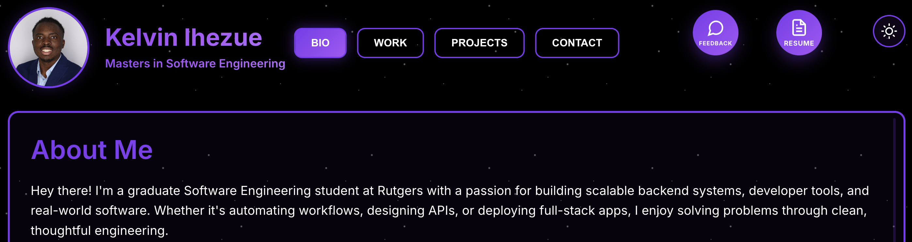
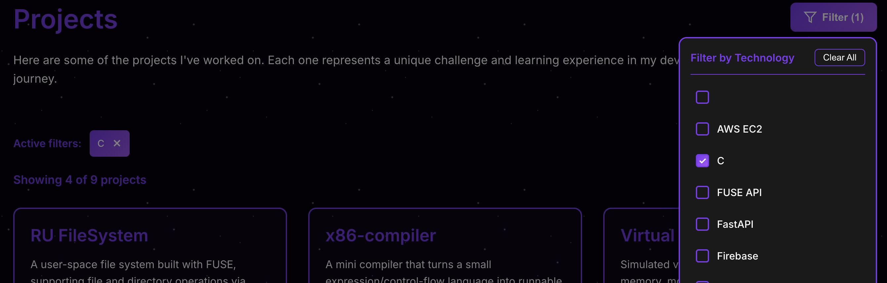
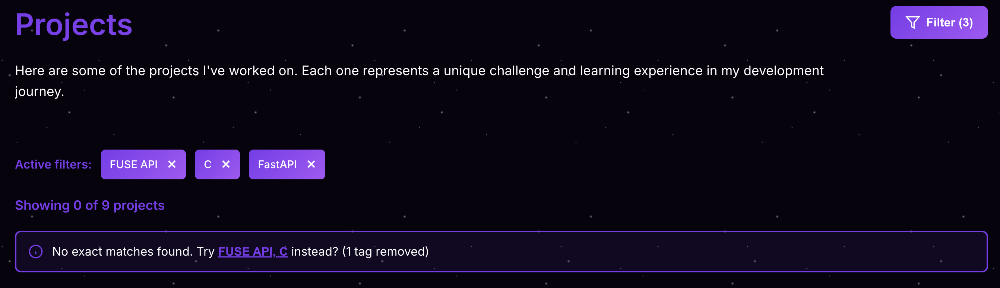
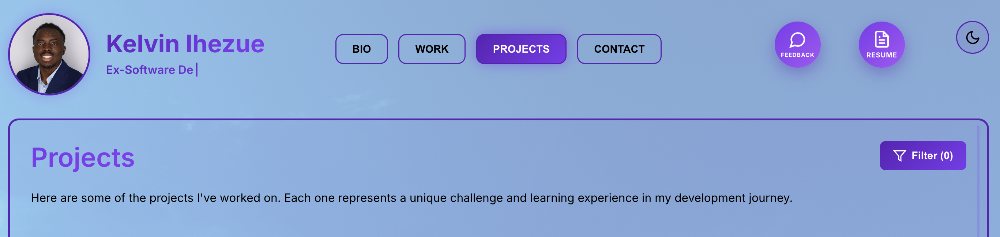
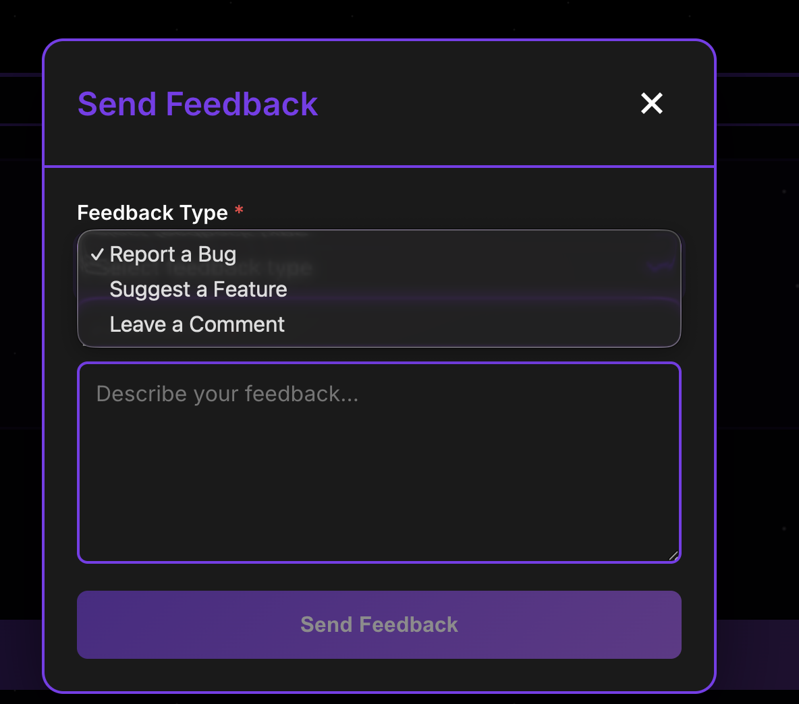
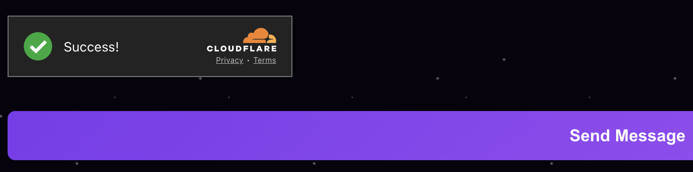

# 🌐 PORTFOLIO WEBSITE 

<br/>

A full-stack **MERN portfolio platform** showcasing projects, experience, and technical skills,
featuring real-time contact & feedback messaging, smart project discovery, and production-grade
infrastructure.

<br/>

<div align="center">
  
  <br/>
  <a href="https://www.kelvinihezue.com/">
    <br/>
    <strong>🔗 Visit Live Website →</strong>
  </a>
</div>


---
## 🚀 OVERVIEW 
This portfolio website is designed to go beyond a static resume. It provides an interactive
way for visitors to explore projects, send feedback, and contact me directly - with messages
securely stored in MongoDB and delivered to my email in real time.

The platform emphasizes **performance, security, and scalability,** while maintaining a clean,
modern user experience with light/dark mode support.

---
## 🧱 Tech Stack & Architecture

### **Frontend**
- **Framework:** React (TypeScript & JavaScript)
- **UI Features:**
    - Light & Dark Mode
    - Responsive Layout
    - Smart project suggestion & filtering system
- **Frontend Deployment:** Vercel

### **Backend**
- **Runtime:** Node.js & Express.js
- **Language:** TypeScript
- **Architecture:** Controller ⟷ Service ⟷ Model
- **API Style:** RESTful JSON API

### **Database**
- **Database:** MongoDB (MongoDB Compass for management)
- **Collections:**
    - Contacts (portfolio messages)
    - Feedbacks (anonymous & categorized)

### **Infrastructure & Cloud**
- **Backend Compute:** AWS EC2
- **Domain & DNS:** Cloudfare
- **Bot Protection:** Cloudfare Turnstile (anti-spam & abuse prevention)
- **Reverse Proxy / Security:** Helmet, CORS configuration
- **Process Management:** Graceful shutdown & production-safe server lifecycle

---
### **🔐 Security & Reliability Features**
- Cloudfare Turnstile bot protection for forms
- Rate-limited contact endpoints
- Secure CORS configuration
- Helmet security headers
- Environment-based configuration (dev vs production)
- Input validation & sanitization
- Email injection & XSS protection

---
### **✉️ Messaging & Notifications**
- **Contact Form:**
  - Accept full user details (name, email, message)
- **Feedback System:**
  - Collects categorized or anonymous feedback
- **Email Delivery:**
  - Integrated **Nodemailer** sends real-time notifications directly to my inbox
- **Persistence:**
  - All submissions stored in MongoDB for auditing & review.

---
## ✨ Key Features

<div align="center">
  <ul align="left"><b>1. Smart project suggestion & filtering system</b></ul>
  
  <br/>
  <strong>Easily filter projects by technology stack 😌</strong>
  
  <br/>
  <strong>Smart project suggestions when no exact filter matches 🤖</strong>
</div>

<br/>

<div align="center">
  <ul align="left"><b>2. Light / Dark Theme Toggle</b></ul>
  
  <br/>
  <strong>Light theme ☀️</strong>
  
  <br/>
  <strong>Dark theme 🌙</strong>
</div>

<br/>

<div align="center">
  <ul align="left"><b>3. Contact & feedback submission with email notifications</b></ul>
  
  <br/>
  <strong>Got feedback? Let me know 😊</strong>
</div>

<br/>

<div align="center">
  <ul align="left"><b>4. Anti-bot protection using Cloudfare Turnstile</b></ul>
  
  <br/>
  <strong></strong>
</div>

<div align="center">
  <ul align="left"><b>5. Clean, modular backend architecture</b></ul>
  <ul align="left"><b>6. Production-ready deployment on AWS</b></ul>
  <ul align="left"><b>7. Health check & monitoring endpoints</b></ul>
  <ul align="left"><b>8. Secure, rate-limited APIs</b></ul>
</div>

---
### **🧪 API Testing (Local)** 
```bash
  # Health check
  curl http://localhost:4000/health
  
  # Contact submission
  curl -X POST http://localhost:4000/api/contact \
    -H "Content-Type: application/json" \
    -d '{
      "name": "Test User",
      "email": "test@example.com",
      "message": "Hello Kelvin!"
    }'
  
  # Feedback submission
  curl -X POST http://localhost:4000/api/feedback \
    -H "Content-Type: application/json" \
    -d '{
      "feedbackType": "Suggestion",
      "message": "Great portfolio design!"
    }'
```

---
### **🔮 What's Next**
Planned enhancements for future iterations:
  - **API & Response Caching (Redis / in-memory caching)**
  - **Optional auto-reply confirmation emails**
  - **Additional UI animations & accessibility improvements**

---
### **👤 Author**
**Kelvin Ihezue** - ```Software Engineer | Full-Stack Developer```


